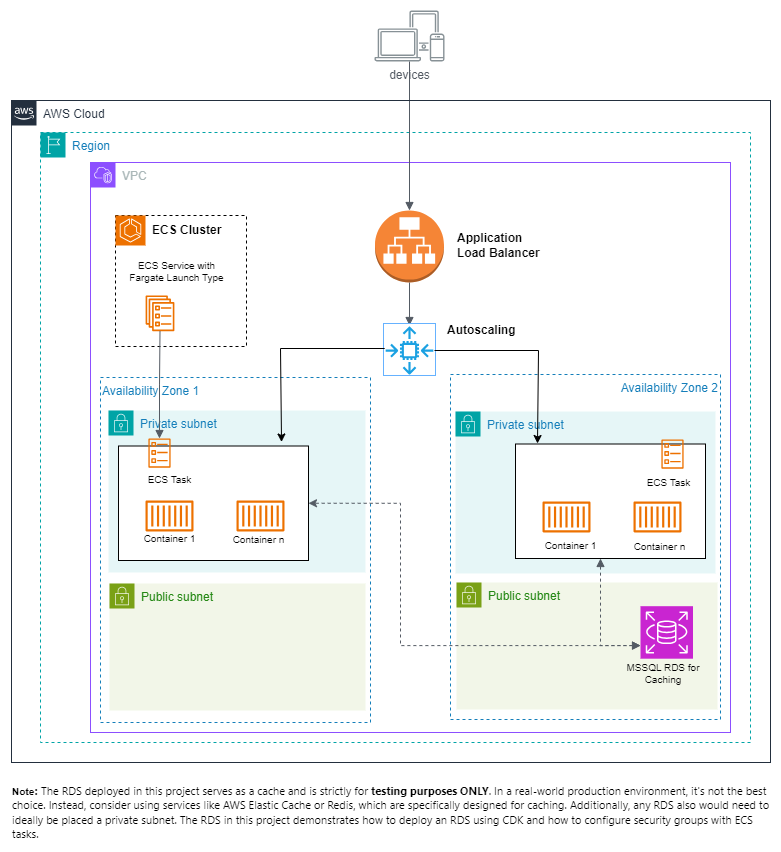

# ECS and ECS Anywhere Sample AWS CDK code

This repository hosts two projects, one developed in TypeScript and the other in C#. Both projects generate identical resources.

Container images were exported to AWS ECR and are referenced within the code.

An AWS certificate (ACM) was previously issued and secrets were stored in AWS Secret Store in advance. This certificate which is used for the AWS load balancer (ALB) and secrets are utilized within the projects.

## NOTE

This project demonstrates how to deploy an RDS using AWS CDK and how to set up security groups with ECS tasks (when hosted on AWS). The primary objective of this proof of concept is to provision ECS containers both in the cloud and on-premises. It is crucial to understand that **the RDS in this project is used as a cache and is strictly for testing purposes**. When considering production environments:

1. The RDS in this project is situated in a public subnet. In a production setting, it should be placed in a private subnet with a NAT in the public subnet for access.
1. RDS is not the best option for caching. Services like AWS Elastic Cache or Redis, which are specifically designed for caching, should be evaluated.
1. The same RDS in this proof of concept was also utilized in the ECS-Anywhere stack for testing, rather than creating a new caching resource on-premises. It's worth noting that in a production setup on-premises, the cache database should ideally be located close as possible to the application (container).
1. For database seeding, a lambda function or a DBUp container can be employed.

## ECS hosted on AWS 




## ECS Anywhere hosted on-premise 


Each project is designed to create and deploy the following:

* A Virtual Private Cloud (VPC)
* Subnets
* A SQL Server RDS instance for caching (this can be moved to private subnet later and add a NAT)
* An ECS Cluster, which includes:
    * An ECS Service
    * A Task Definition
    * Tasks
    * An Application Load Balancer (ALB)
    * A Route53 public host that serves as an alias for the ALB subdomain
* An ECS Anywhere Cluster, which includes:
    * An ECS Service
    * A Task Definition
    * Tasks
    * A Traefik proxy/load balancer that identifies the ports and dynamically registers and connects to containers in the external instance.

At present, the AVI NSX Load Balancer is connected to the Traefik Proxy on port 443.

The entire project is secured end-to-end with TLS. The deployed projects can be accessed at:

* https://ecs.my.la.gov
* https://ecs-anywhere.my.la.gov


## Initial Setup:

1. Ensure that you have an AWS account. If you have access to multiple accounts, you can set up a profile.
2. Install the latest version of `aws cdk` using the following command:
```
npm install -g aws-cdk
```
3. For additional details, refer to steps 1-3 at the following link: https://docs.aws.amazon.com/cdk/v2/guide/getting_started.html

## Project Execution:

### Csharp Project:

1. Open the solution in Visual Studio to inspect the files. The `Program.cs` file, which is responsible for running the project, invokes and generates different stack files. Each file creates and deploys multiple resources, some of which are injected into other stacks for reference and usage.

2. Navigate to the `csharp` folder using the CLI and locate the `cdk.json` file. Take note of the `app` property in the `cdk.json` file as it directs CDK to the project location.
```
cd /csharp
```

### Typescript Project:

1. Open the project in Visual Studio Code to inspect the files. The `/bin/myla-cdk.ts` file, which is responsible for running the project, invokes and generates different stack files. Each file creates and deploys multiple resources, some of which are injected into other stacks for reference and usage. The stacks are in the `/lib/` folder.

2. Navigate to the `typescript` folder using the CLI and locate the `cdk.json` file. Take note of the `app` property in the `cdk.json` file as it directs CDK to the project bootstrap location.

## CDK Command Usage:

1. Execute the following command to synthesize a CDK app into CloudFormation templates. The output will be created in the `/[language]/cdk.out` folder. The CloudFormation templates by default  are in `json` format.
```
cdk --profile [YOUR_PROFILE_NAME] synth
```
To generate a yaml formatted output (optional):
```
cdk --profile [YOUR_PROFILE_NAME] synth NetBaseStack >> cdk.out/NetBaseYaml.yaml  
```
2. To compare any changes between the deployed CloudFormation template and the local one, use:
```
cdk diff --profile [YOUR_PROFILE_NAME]
```
3. To deploy all the stacks:
```
cdk deploy --profile [YOUR_PROFILE_NAME] --all 
```
To deploy specific stacks:
```
cdk deploy --profile sandbox NetBaseStack StatefulStack  
```

4. To remove the stack:
```
cdk destroy --profile [YOUR_PROFILE_NAME] --all
```

## Notes

If a deployment encounters an error for any reason, the AWS CloudFormation stack will automatically revert to its last successful version through a process known as rollback.

Additional commands can be found at: https://www.npmjs.com/package/aws-cdk

Sample projects are available at: https://github.com/aws-samples/aws-cdk-examples